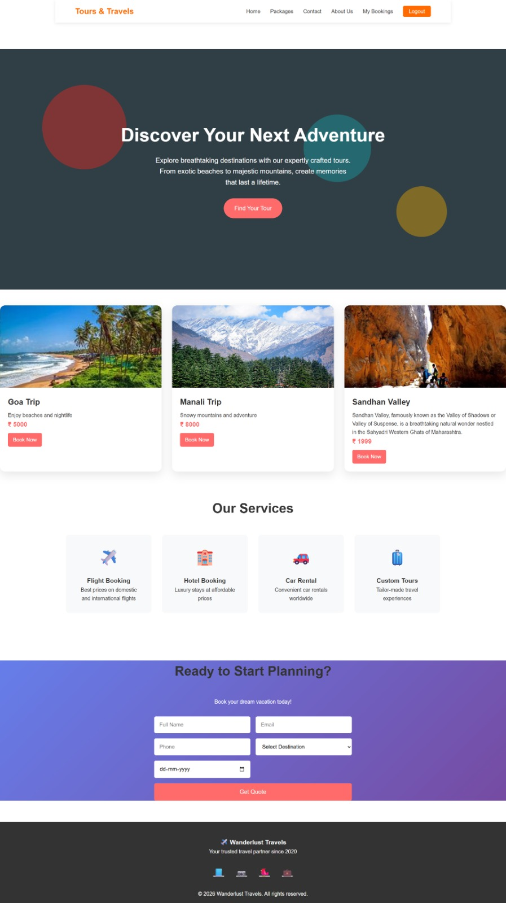
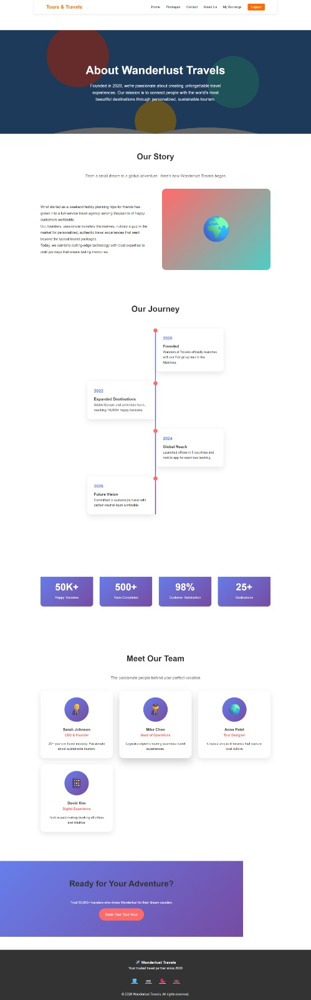
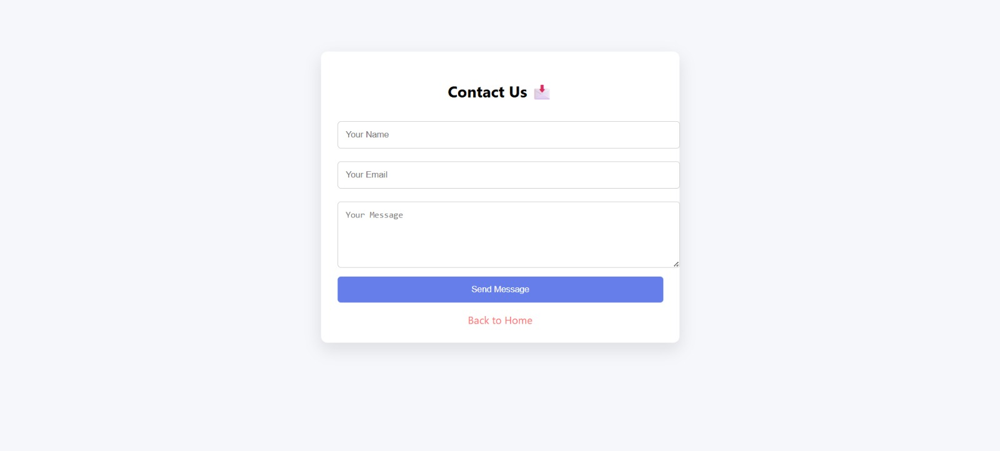
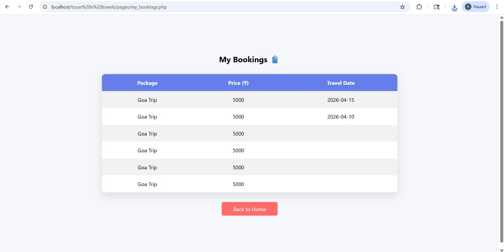
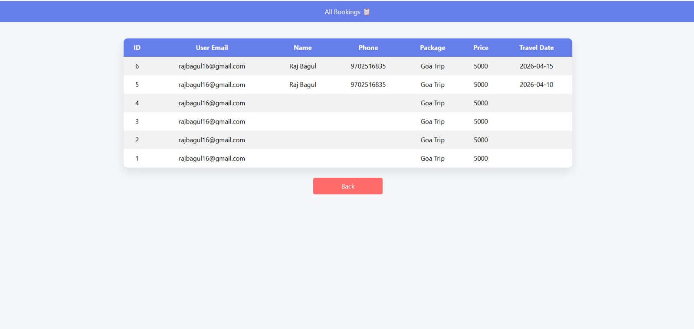
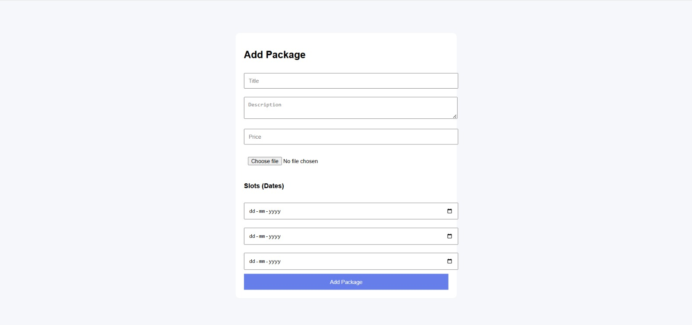
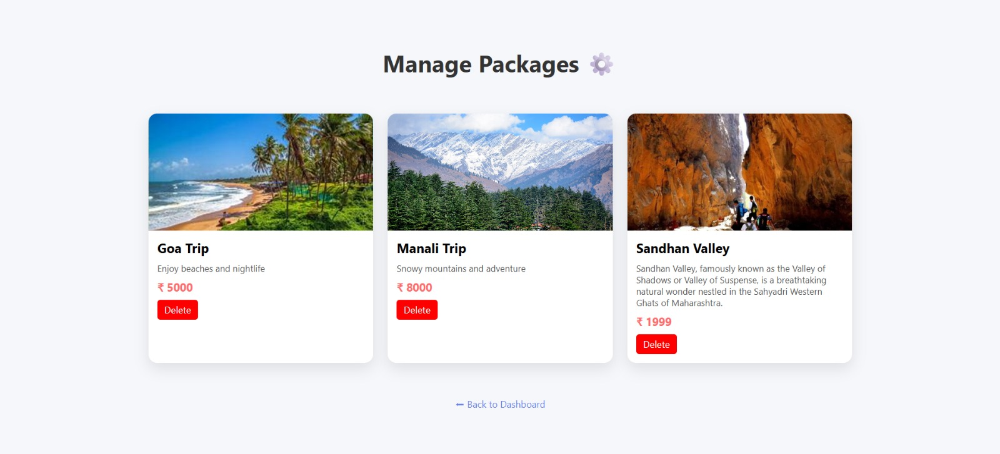
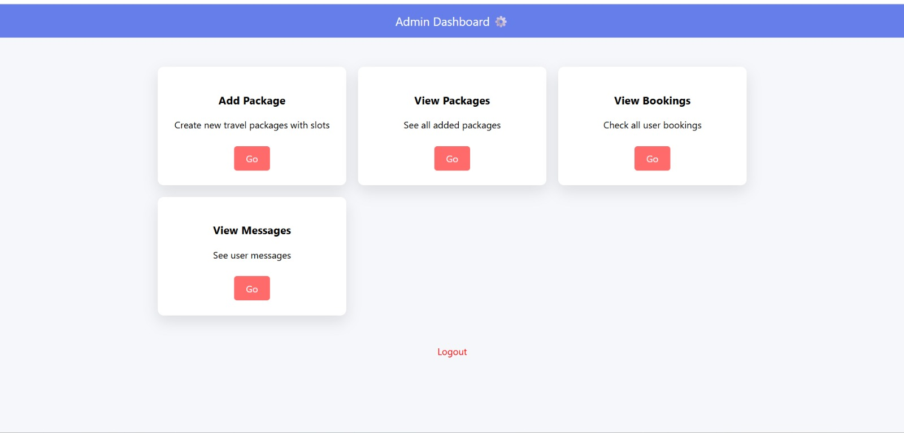
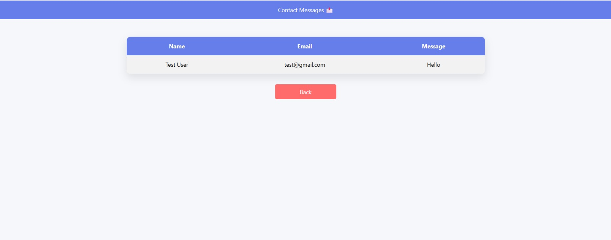
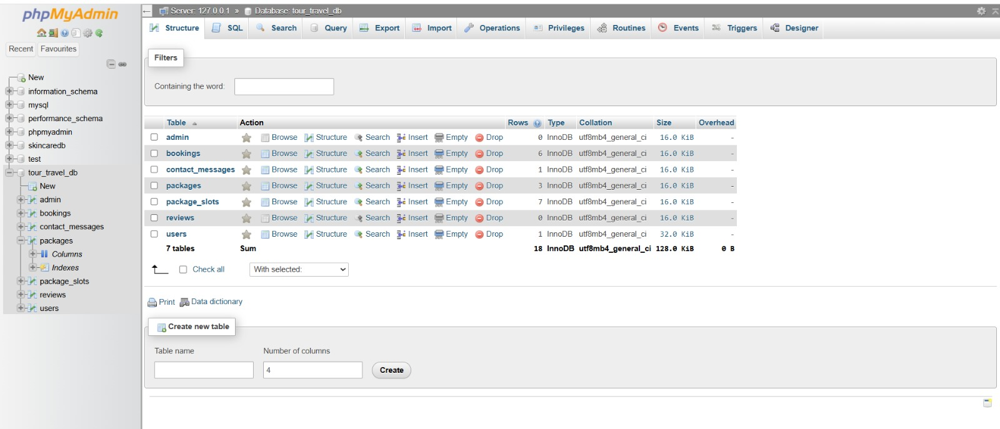

# 🌍 Wonderlust Demo – Tour & Travel System (UI Showcase)

This repository contains a **visual demo (screenshots)** of the *Wonderlust Tour & Travel Booking System*.  
It showcases the UI design, features, and workflow of the application.

⚠️ **Note:** This repo is for demonstration purposes only. Source code is not included.

---

## 🚀 Project Overview

Wonderlust is a **tour and travel booking platform** designed to help users explore packages, make bookings, and interact with travel services.  
It also includes an **admin panel** for managing packages, bookings, and customer queries.

---

## ✨ Key Features (Showcased)

### 👤 User Panel
- User Registration & Login
- Browse Travel Packages
- View Package Details
- Book Trips
- View My Bookings
- Contact Form

### 🛠️ Admin Panel
- Admin Dashboard
- Add & Manage Packages
- View All Bookings
- Handle Contact Messages

---

## 📸 Screenshots

### 🏠 Home Page

### 📦 Packages Page

### 📄 About Us

### 📞 Contact Page

### 🧳 My Bookings

### 📋 All Bookings (Admin)

### ➕ Add Package (Admin)

### 🛠️ Manage Packages (Admin)

### 📊 Admin Dashboard

### 🔐 Admin Login

### 📩 Contact Messages

### 🗄️ Database Structure

---

## 💻 Tech Stack (Used in Development)

- HTML, CSS, JavaScript  
- PHP  
- MySQL  
- XAMPP  

---

## 📌 Purpose of This Repository

- To showcase **UI/UX and project flow**
- To present the project for **portfolio and demonstration**
- To highlight **full-stack development capabilities**

---

## 🙌 Author

**Piyush Bihare**  
Junior Full Stack Developer  

---
